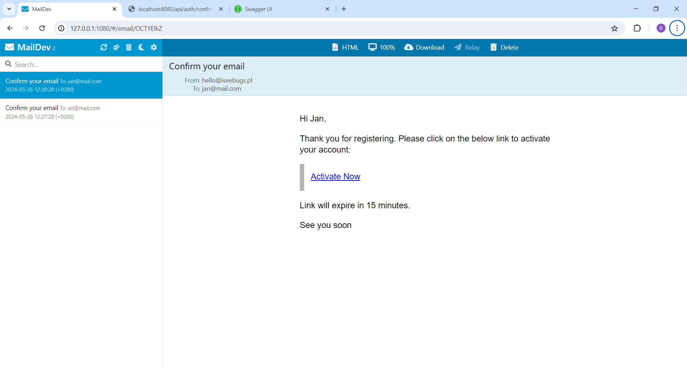
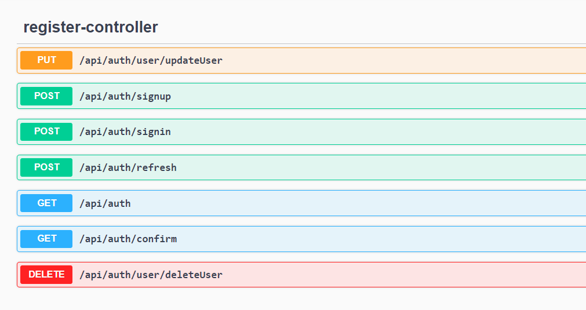

# Spring Security Module
### Overview
The module covers all basic authorization and authentication features.

## Scope of the project

### Live demo in postman

📺[Watch the demo on YouTube](https://www.youtube.com/watch?v=INOvOtW8JO8)📺



### Major features:
- Registration with:
  - Token confirmation
  - Email confirmation
- Login 
- Tokens:
  - Register
  - Refresh
  - Access
- Token refreshing
- User updating
- User deleting

## API💡
Access the API documentation at:
[Swagger UI](http://localhost:8080/swagger-ui/index.html#/)



 ## Tech ✅
- Java
- SpringBoot
  - Spring Security
  - Spring Mail
  - Spring JPA
- Hibernate
- PostgreSQL
- Swagger
- Lombok
- Postman
- Maildev
- Docker

## Run🚀

### Fast launch🚀

- ```docker-compose up -d```
- ```maildev```
- ```mvn spring-boot:run ```

### Launch🚀

Each task need a different terminal:
1. Database docker image
- ``` docker-compose up -d```

You can check the database on:

```java
http://localhost:5000/
```
With credentials:

| Rodzaj bazy | PostgreSQL |
|-------------|------------|
| Serwer      | db         |
| Użytkownik  | postgres   |
| Hasło       | pass       |
| Baza danych | auth       |

You can check the database on:

```java
http://localhost:5000/
```

If you want to have individual credentials to database you have to create `.env` file in the main root.

```java
POSTGRES_USER=your_user
POSTGRES_PASSWORD=your_password
```

2. Instal and run MailDev to receive emails:

- ```npm install -g maildev``` - instal
- ```maildev``` - run

Access MailDev at:

```java
http://127.0.0.1:1080/
```
3. Run the project
- ```mvn spring-boot:run ```

## My Linkedin:
https://www.linkedin.com/in/bartlomiejtucholski/


 
